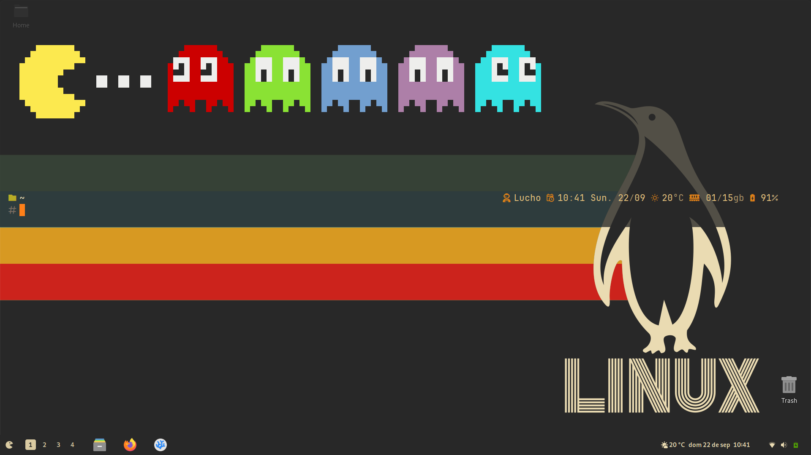

# oh-my-gruvbox [🔗 See Code](src/oh-my-gruvbox.omp.json)

**Oh My GruvBox**: Introducing a sleek, Gruvbox-inspired Oh-My-Posh theme that transforms your terminal's aesthetics with a rich and vibrant color palette. Ideal for developers who appreciate a blend of retro vibes and modern functionality, this theme ensures a delightful and visually appealing coding environment. With its seamless integration and bold, eye-catching colors, your terminal has never looked this good. Enhance your productivity and inspire creativity with every line of code you write. Dive into a captivating coding experience and make your terminal not just a tool, but a statement of style and flair.

[🔗 See Code](src/oh-my-gruvbox.omp.json)
